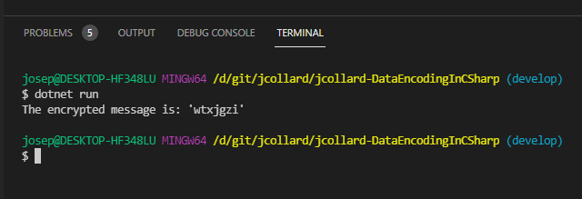

# Message Encryption/Decryption Challenge (Graded)

In this repository there are several files which have encrypted messages.
These messages were encoded by taking taking a string of characters and adding
some number to each of the characters. This process of encryption is known as a
**shift cipher**. If you're interested in knowing more, there is a decent
article about it on Wikipedia: [LINK](https://en.wikipedia.org/wiki/Caesar_cipher)

Your challenge is to finish writing the encrypt and decrypt methods provided in the `Cipher.cs`
program then use your implementation to decrypt each of the messages in the
`secrets` folder.

- [Message Encryption/Decryption Challenge (Graded)](#message-encryptiondecryption-challenge-graded)
  - [Getting Started](#getting-started)
  - [Encrypt Method](#encrypt-method)
    - [Commit and Push](#commit-and-push)
  - [Decrypt Method](#decrypt-method)
    - [Commit and Push](#commit-and-push-1)
  - [Decrypting secrets/1.txt](#decrypting-secrets1txt)
    - [Loading a Text File](#loading-a-text-file)
  - [Command Line Arguments](#command-line-arguments)
  - [Decrypting All the Files](#decrypting-all-the-files)
  - [Decrypted Messages](#decrypted-messages)
  - [Submitting your Solution](#submitting-your-solution)

## Getting Started

1. Start by deleting (or commenting) the code that is currently in your `Main`
   method. (This is why we committed and tagged our work.)


2. Create a `Cipher` variable named `cipher`.
3. Assign `cipher` to store the result of running `new Cipher(5)`


4. Create a `string` variable named `encrypted`
5. Assign `encrypted` to store the result of running `cipher.Encrypt("rosebud")`;
6. Write the result to the console.


7. Next, run your program to test it.


## Encrypt Method

Unfortunately, the `Encrypt(string)` method is incomplete. Let's take a look at it.

1. Open the `Cipher.cs` file.
2. Scroll down to the `Encrypt` method.


Currently, this method simple loops through the provided string message and
copies each character into a string variable `newMessage` which is then
returned. In short, it just copies the original message.

To finish this method, you need to increase the value of each character by
`this.shift` (the shift amount specified in the constructor).

When you have successfully completed your `Encrypt` method, your program should
output `wtxjgzi`.



### Commit and Push

When you finish the `Encrypt(string)` method, you should:

1. Save all your work
2. Commit your work. Your message should be something like `feat: Add Encrypt method`
3. Push your works

## Decrypt Method

The `Decrypt(string)` method works very similar to the `Encrypt(string)` method.
However, it should "unshift" each character.

You can test that your `Decrypt(string)` method works by applying it to a
previously encrypted message:


### Commit and Push

When you finish the `Decrypt(string)` method, you should:

1. Save all your work
2. Commit your work. Your message should be something like `feat: Add Decrypt method`
3. Push your works

## Decrypting secrets/1.txt

Finally, you must decrypt the files that are in the `secrets` folder. Each file
is encrypted using a shift between 1 and 10. The file `secrets/1.txt` is
encrypted using a shift of `3`. 

### Loading a Text File

First, let's start by loading a text file into a variable. This can be done by
using a built in C# method `System.IO.File.ReadAllText(string path)`. This
method accepts 1 string parameter which is the path to the file to be loaded. It
then returns a string with the contents of that file.

1. Create a `string` variable called `message`.
2. Read `secrets/1.txt` using `ReadAllText("secrets/1.txt")`.
3. Store the results in `message`.
4. Write the results to the console.


Next, create a Cipher using a shift of `3` and decrypt the message.

5. Create a `string` variable that will store the decrypted message.
6. Create a `Cipher` variable that will store a Cipher with a shift of 3
7. Run the cipher's `Decrypt(string)` method on `message`
8. Store the result in the `string` variable you created
9. Write the results to the console.

When you've successfully completed this, you should have output that looks
similar to the following:


## Command Line Arguments

Currently, your program only loads `secrets/1.txt`. If you want to try and
decode another file, you need to rewrite your program. This is can be incredibly
annoying. Wouldn't it be great if you could specify the file you want to decode
by running `dotnet run secrets/1.txt` or `dotnet run secrets/2.txt`?

Well, you can! 

You may have been asking yourself, what the heck is this weird `Main(string[]
args)` thing that I have in my program.


This is an array of arguments the user specified when running the program. An
array can be thought of as a list that has a fixed size. **Note**: Don't worry
too much about arrays just yet, they're not super important for this activity.

You can use this to allow the user to specify which file they would like to
decode when the program is executed. 

At the start of your Main method:

1. Create a `string` variable called `filePath`
2. Assign `filePath` to store the first (0th) element of the `args` array.
3. Write the `filePath` to the console.
4. Replace `"secrets/1.txt"` with `filePath`.


5. Execute your program specifying `secrets/1.txt` as the file to decode


## Decrypting All the Files

Unfortunately, you don't know the shift value for each file. However, you do
know the possible value for the shifts: 1, 2, 3, 4, 5, 6, 7, 8, 9, 10.

You could go through each file and manually by hand and run each possible cipher
over the string to find the correct answer. However, this would be incredibly
tedious. Instead, we can write a loop to iterate through each value. Here is the general
algorithm:

1. Create an `int` variable `shift` and set it to 1
2. Use a `while` loop that executes if `shift <= 10`
3. Within the loop:
   1. Create a cipher using the current `shift` value
   2. Run the `Decrypt(string)` method
   3. Write the result to the console
   4. Increment `shift` by 1.

Once you have done this, you can "eye-ball" each output and select the one that
is not gibberish.

For example:


## Decrypted Messages

After decrypting each message, add them below:

```
1. You have decrypted this message!
2. ?
3. ?
4. ?
5. ?
6. ?
7. ?
8. ?
9. ?
```

## Submitting your Solution

When you are finished:

1. Save all of your files.
2. Commit your files. Your message should be something like `chore: Finish
   decrypting messages.`
3. Push your work
4. Create a tag called `solution`
5. Push your tag
6. Verify your work is visible on your Pull Request
