# Data Encoding in C#

In this activity, you will explore how text is represented in a computer using
binary. When you have finished this activity you should:

* Have a basic understanding of encoding with binary
* Be able to convert between ASCII, Decimal, Binary, and Hexadecimal
* Know how to use C# to convert values between `char` and `int` encodings
* Write a program that can encrypt and decrypt text files using a Shift Cipher

- [Data Encoding in C](#data-encoding-in-c)
  - [Task List](#task-list)
  - [Setting up Repository](#setting-up-repository)
  - [What is Encoding?](#what-is-encoding)
  - [Encoding Text as an Integer](#encoding-text-as-an-integer)
    - [Quick Binary Question](#quick-binary-question)
  - [Creating a Simple Encoding for Letters](#creating-a-simple-encoding-for-letters)
    - [AP Exam Practice](#ap-exam-practice)
  - [Encoding Text in C](#encoding-text-in-c)
    - [Converting from char to int](#converting-from-char-to-int)
    - [Converting from int to char](#converting-from-int-to-char)
    - [Arithmetic with Characters](#arithmetic-with-characters)
    - [Tag your work](#tag-your-work)
  - [Complete the Challenge](#complete-the-challenge)

## Task List

- [ ] Complete Project Setup: [LINK](Setup.md)
- [ ] Learn about encoding text in C#: [LINK](#what-is-encoding)
- [ ] Complete the Cipher Challenge: [LINK](Cipher.md)

## Setting up Repository

Before continuing, you should:

1. Make a copy of this repository to store your work
2. Add Mx. Collard as a collaborator
3. Clone your repository
4. Create a develop branch on your repository
5. Initialize a new C# project in your repository
6. Commit and push your initialized project
7. Create a Pull Request from `develop` to `main`
8. Add Mx. Collard as a reviewer

If you're not sure how to do these things, you can follow the setup
instructions: [LINK](Setup.md)

## What is Encoding?

Encoding is a process which converts data from one form to another form. For
example, when we take a value that is in decimal and convert it to its binary
form we can say that we are **encoding** the number in binary. Similarly, when
we change a binary number to its hexadecimal form, we can say that we are
**encoding** the number in hexadecimal.

## Encoding Text as an Integer

As we have previously discussed, everything stored in a computer is a sequence
of bits. It can be a bit mind bending to try and process this because it really
doesn't **feel** like everything is a sequence of bits when you look at your
screen. You see images and text. You hear audio and watch videos. How can this
all be encoded as a bunch of bits?

Well... the short answer is that people have spent thousands upon thousands of
hours creating encodings for data to be represented in a way that humans can
process it.

To begin understanding how encodings work, let's start with something relatively
simple: Text.

If we want to represent the English alphabet, we need to be able to encode 26
different letters. 

### Quick Binary Question

What is the minimum number of bits to be able to represent the English alphabet?

** ADD YOUR ANSWER HERE **

## Creating a Simple Encoding for Letters

A simple way to encode each letter would be to start with the number 0 and
increment by one assigning each letter a unique identifier. For example:

| ID   | Letter | | ID   | Letter |
|------|--------|-|------|--------|
| 0x00 | A      | | 0x0D | N      |
| 0x01 | B      | | 0x0E | O      |
| 0x02 | C      | | 0x0F | P      |
| 0x03 | D      | | 0x10 | Q      |
| 0x04 | E      | | 0x11 | R      |
| 0x05 | F      | | 0x12 | S      |
| 0x06 | G      | | 0x13 | T      |
| 0x07 | H      | | 0x14 | U      |
| 0x08 | I      | | 0x15 | V      |
| 0x09 | J      | | 0x16 | W      |
| 0x0A | K      | | 0x17 | X      |
| 0x0B | L      | | 0x18 | Y      |
| 0x0C | M      | | 0x19 | Z      |

Then, using this table, we can encode or decode a message. For example:

```
HELLO => 0x07040B0B0E
MY    => 0x0C18
NAME  => 0x0D000C04
IS    => 0x0812
JOE   => 0x090E04
```

Notice, with our current encoding we can only represent upper or lower case
messages with letters. We cannot represent spaces, capitalizations, new lines,
or punctuations. 

In the early days of computers, there was no standard way for encoding text in a
computer. This wasn't a big issue because there were only a few computers in the
world. However, as more and more computers were built and people began sharing
data, it became increasingly difficult for people to share their data. To try
and solve this problem, a group of computer engineers came together to develop
the **American Standard Code For Information Interchange** or "ASCII"
(pronounced as-key).

The initial version of ASCII used 7-bits resulting in 128 different values:


Later, it was extended to use 8-bits:


As time went on, 8-bits was not enough and another protocol called UTF-8 was
created which uses a much more complex encoding scheme that takes into account
language which results in 1,112,064 combinations and is used by **most** modern
computers. **This little fact about UTF-8 is not important for the AP Exam**

### AP Exam Practice

Using the ASCII Table above, translate each of the following 8-bit binary
numbers to their ASCII encoding:

* 0b1100_0001 - PUT THE ASCII CHARACTER HERE
* 0b0010_0000 - PUT THE ASCII CHARACTER HERE
* 0b0011_1101 -
* 0b0101_0100 -

## Encoding Text in C#

In most programming languages, there is a data type called a **character**. When
hear or see this word in relation to computers, it usually means a single letter
or symbol. For example: `a`, `$`, `.`, `(`, and `Z` are all characters.

In C# (and many other programming languages), this data type is abbreviated as
`char`. This is pronounced "care" since it is short for "character". However,
you will find that many people pronounce it similar to "charcoal". If you
mispronounce it, that is okay (just know I will make fun of you).

Let's see what this looks like in code.

1. Update your `Program.cs` file to include a variable `ch` of type `char`.
2. Assign `'A'` to be stored in `ch`
   * Notice, we use single quotes when we refer to a single character. 
3. Write `ch` to the console.

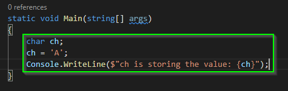

4. Run your program to see the results

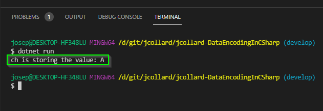

Hopefully, there wasn't anything too surprising here.

### Converting from char to int

Next, let's convert `ch` into an int so we can see its decimal value.

1. Update your code to have an `int` variable named `ch_decimal`
2. Assign `ch_decimal` to store `ch`
3. Write the value to the console.

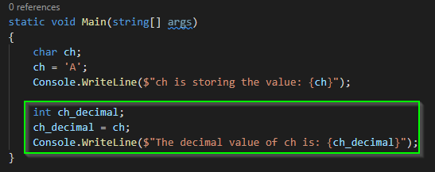

2. Run the program to see the decimal value

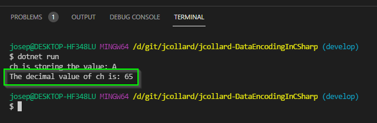

### Converting from int to char

Next, let's convert an integer to its character value. 

Start by updating your code to ask the user to type in an integer.

1. Create an `int` called `toConvert`
2. Prompt the user to enter an integer.
3. Use `Console.ReadLine()` to read user input from the console.
4. Use `int.Parse` to read the users input as an integer.
5. Finally, assign `toConvert` to store the result.

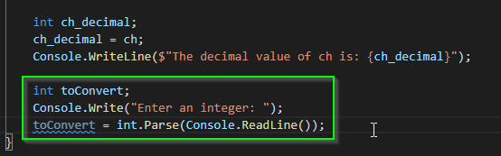

6. Run your program to test that it allows the user to enter a number.

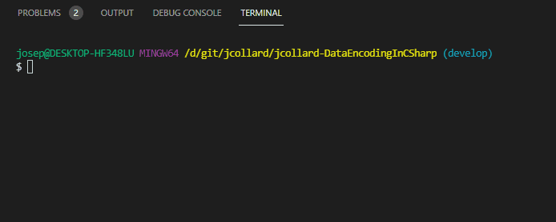

7. Create a `char` called `asChar`
8. Assign `asChar` to store `toConvert`

You'll notice that this results in a compilation error!

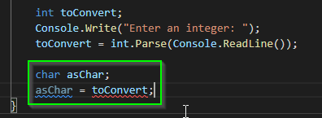

If you try to run your program, you will receive the following error:

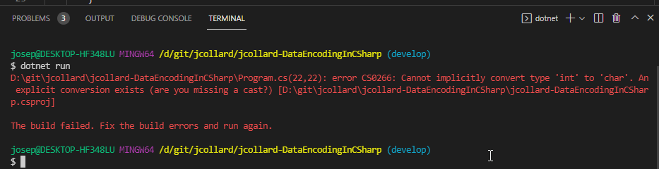

This error message tries to be helpful. If you look closely, it tells you which
line the error is occurring followed by a (sometimes) useful message.

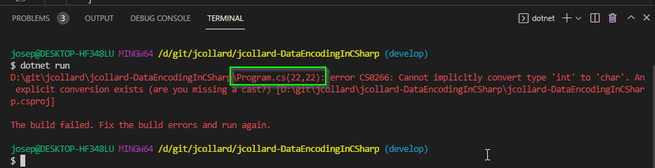

For me, my error was on line 22. And the specific error message was `Cannot
implicitly convert type 'int' to 'char'. An explicit conversion exists (are you
missing a cast?)`

The less technical version of this error would be "I do not know how you want me
to convert a character to an integer because a character uses less bits than an
integer and might result in an error".

In C#, `char` values are 16-bit unsigned (positive) integers. An `int` values are 32-bit
signed (positive / negative) integers. When you try to convert an `int` to a
`char` it might not always be possible. However, we can perform a "cast" which
will tell C# that we want to to convert it to an `char` by simply dropping all
of the bits that won't fit.

The syntax for this is to simply put the word `char` in parenthesis next to the
variable you want to cast.

9. Update your code to cast `toConvert` to a `char` before assigning it to `asChar`.
10. Write the result to the console.

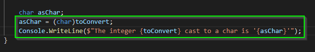

11. Finally, run your program 

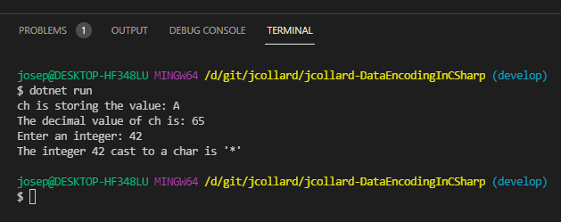

### Arithmetic with Characters

Because characters are just integers, we can actually perform arithmetic on
them. Let's try this out:

1. Create a `char` variable named `b`
2. Assign `b` to store the value `(char)('A' + 1)`'.
3. Write the result to the console.

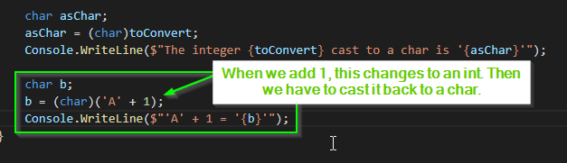

4. Run your program to see the result:

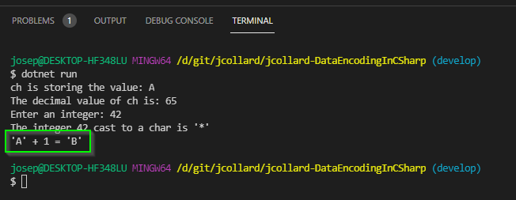

### Tag your work

Before continuing to the next section of this activity, you should:

1. Save your work
2. Commit your work (message should be something like "chore: Finished first
   part of activity.")
3. Create a tag called `part-one`
4. Push your work to GitHub

## Complete the Challenge

Now that you have a basic understanding of character encodings, complete the
challenge described in the Cipher.md file: [LINK](Cipher.md)