# Setup

## Make a copy of this repository

Start by making a copy of this repository.

1. Click the `Use this template` button on the main repository:

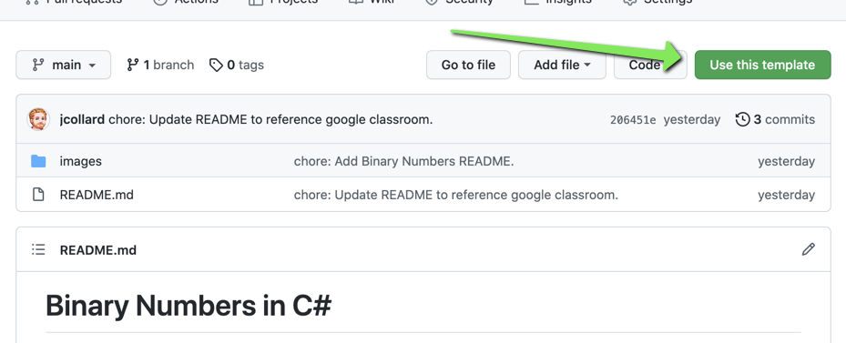

2. Name your repository `XXXXXX-DataEncodingInCSharp`, replacing the `XXXXXX`
   with your the first part of your email. (This is so I can easily find it
   later.)
3. You may make your repository public **or** private.
4. You do **not** need to include all of the branches

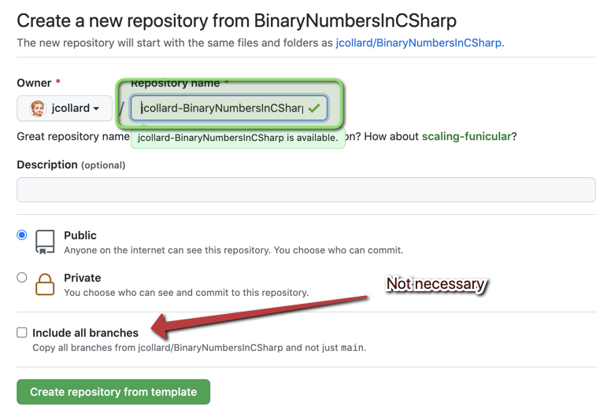

## Add Mx. Collard as a Collaborator

For grading purposes, you need to add me to your repository so I can see your
work.

1. On the copied repository go to the settings tab

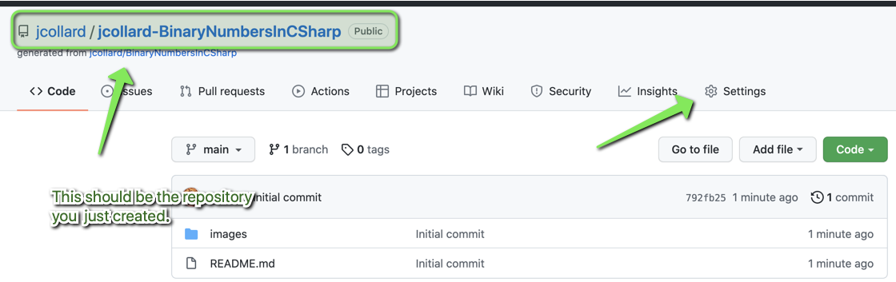

2. On the settings page, select the `Manage Access` option on the left.

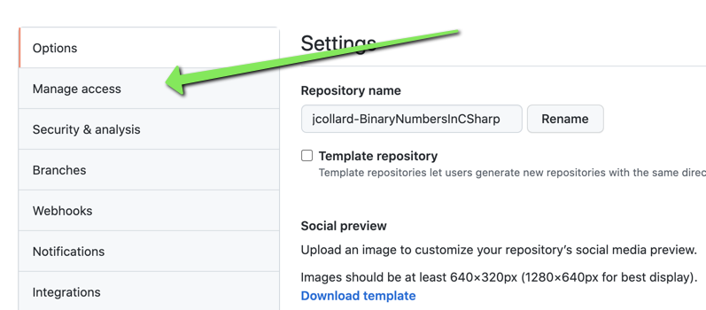

3. On the manage access page, select `Add people`

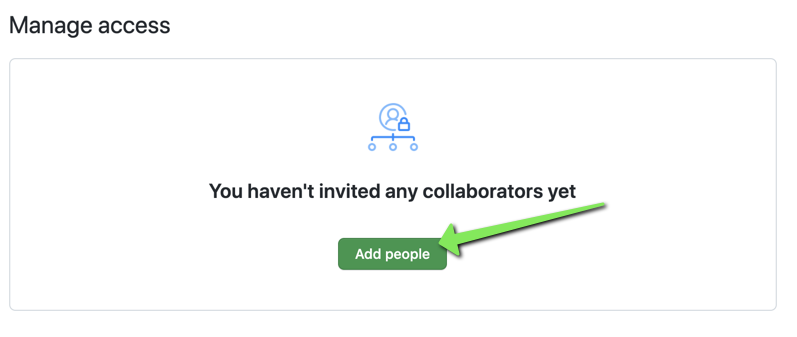

4. Search for `jcollard` and add me as a collaborator.

## Add a Development Branch

With the exception of the group project, we have mostly been working on the
`main` branch of our repositories. This is considered poor practice. The `main`
branch is typically reserved for completed work on projects. A secondary branch
called `develop` is typically created where you can work without fear of
"polluting" the `main` branch.

1. Using GitHub Desktop, Clone your new repository.
2. Open your project in Visual Studio Code
3. Use the command palette (Command + Shift + P) to run `Git: Create Branch`

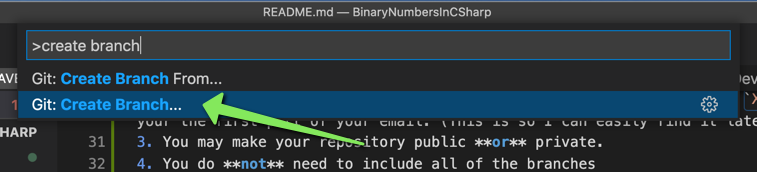

4. Name your branch `develop`

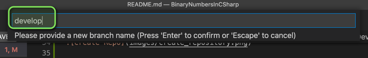

## Push your branch to GitHub

By default, a new branch is created locally on your computer (not published). To
ensure your work is visible, you need to push your repository to GitHub.

1. Use the command palette to run `Git: Push`

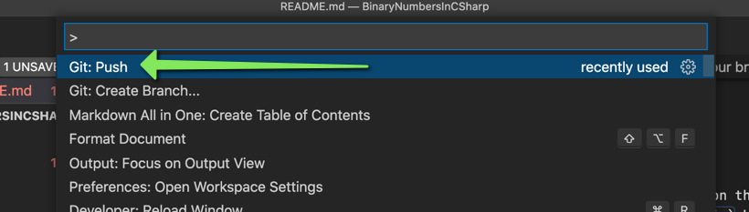

2. You will likely be prompted that your branch is not published. Select `Okay`
   to publish the branch.

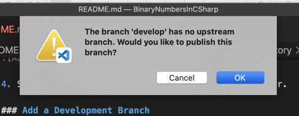

## Create a new C# Project

Let's start by creating a new C# project in this repository.

Before continuing, verify that you are on your `develop` branch. You can see
which branch you are on by looking in the bottom left corner of Visual Studio
Code.

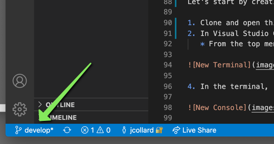

1. Clone your repository to your computer using GitHub Desktop
2. Open the cloned repository in Visual Studio Code
3. In Visual Studio Code, open a new Terminal
   * From the top menu select Terminal > New Terminal

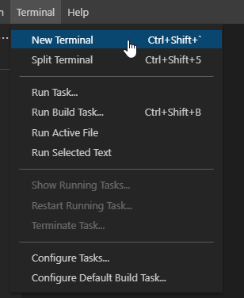

4. In the terminal, run the command `dotnet new console`
   * This creates a new template C# project.

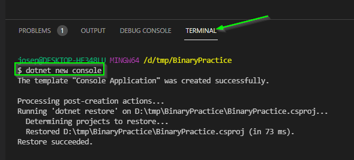

If all went well, you should now see several project files in your package
explorer.

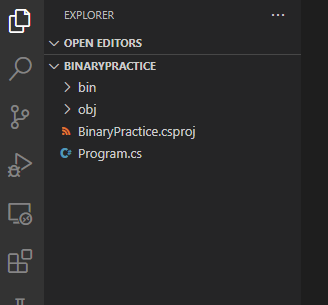

5. If Visual Studio Code prompts you that there are missing assets, you can
   safely click `Yes`.

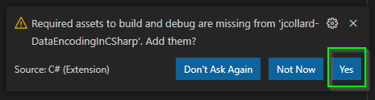

1. Open the `Program.cs` file. This file contains a simple "Hello World" program
   you can run.

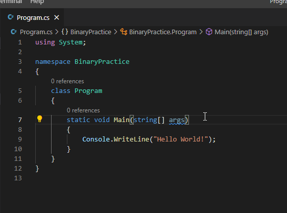

6. Run the project by executing `dotnet run` in your terminal.

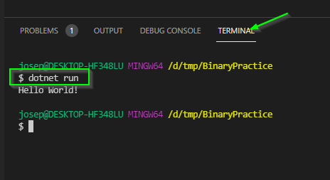

## Create a Pull Request

Next, you will push your base project to GitHub and create a Pull Request that
will allow Mx. Collard (and yourself) to see the changes that have been made to
this project.

1. Commit your work. 
   * Your commit message should be something like `chore: Initialize project`
2. Push your work
3. In your web browser, visit your repository
4. Select the `Pull Request` tab

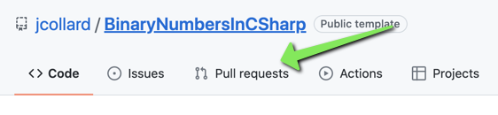

5. Select the `New Pull Request` button

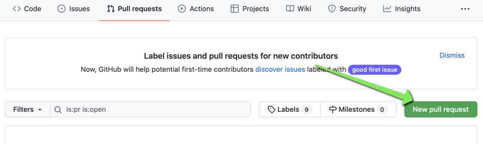

6. Select that you would like to pull your `develop` into your `main` branch.

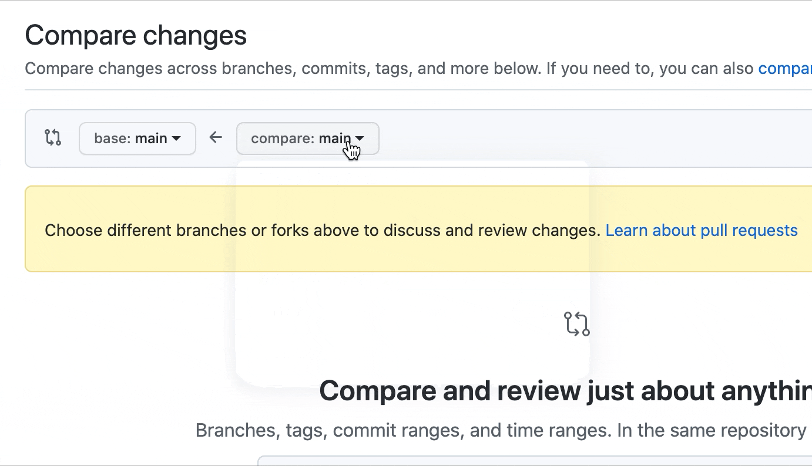

7. Select `Create Pull Request`

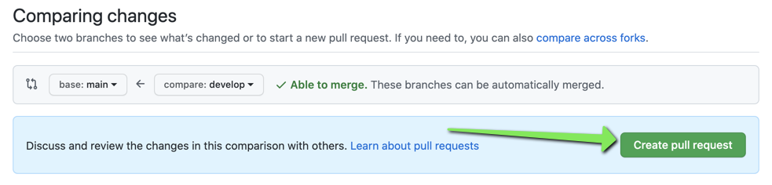

8. Next add `jcollard` as a reviewer. (Note: This option will not be available
   until Mx. Collard accepts your invitation. You may need to skip this for now
   and add them later.)

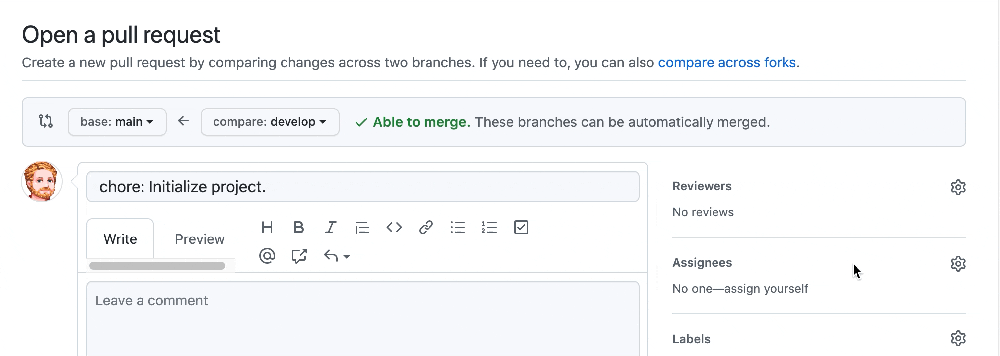

9. Finally, click `Create Pull Request`

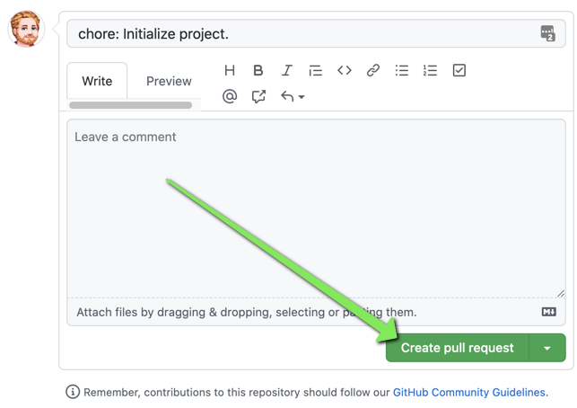